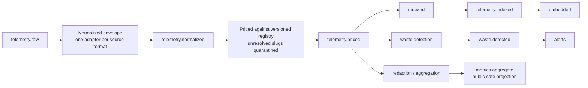

# Architecture

The telemetry pipeline uses `session_id` as the partition key on every topic.

Indexing and embedding are CHAINED (not fanned out) because two consumers writing the same Elasticsearch document would race.
